<div align="center">
  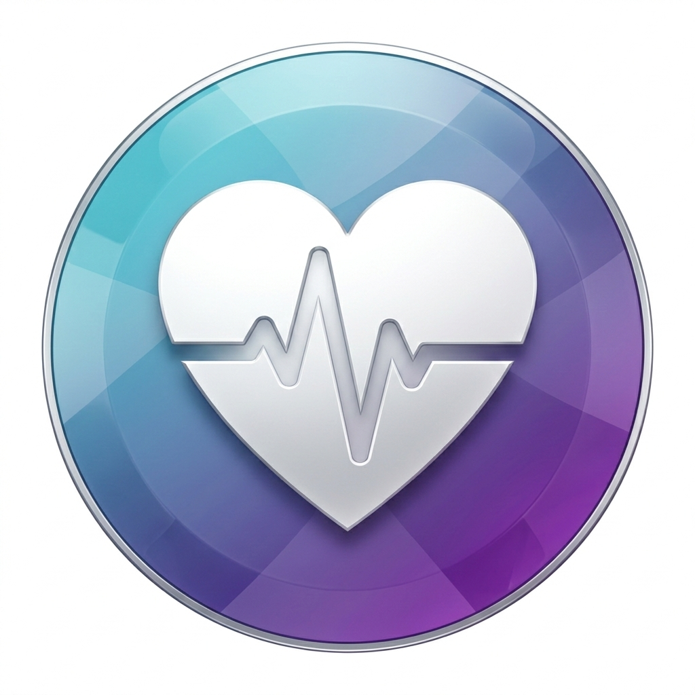
  
  # Health Monitoring App
  
  <b>Your Personal Health Assistant</b>
  
  <i>Track, analyze, and improve your health with AI-powered insights, beautiful charts, and seamless notifications.</i>
</div>

---

## 🚀 Features

- 🔐 Secure Login & Sign Up (with Firebase Auth & Google Sign-In)
- 🏠 Beautiful Splash Screen
- 📊 Health Data Tracking & Visualization (charts, graphs)
- 🤖 AI Health Assistant (Gemini AI integration)
- 🩺 Camera-based Heart Rate Scanner
- 🔔 Smart Notifications & Reminders
- 🗂️ Local & Cloud Data Storage
- 📄 PDF Report Generation
- 🌙 Dark & Light Mode
- 📱 Responsive UI for all devices

---

## 🖼️ Screenshots

<div align="center">
  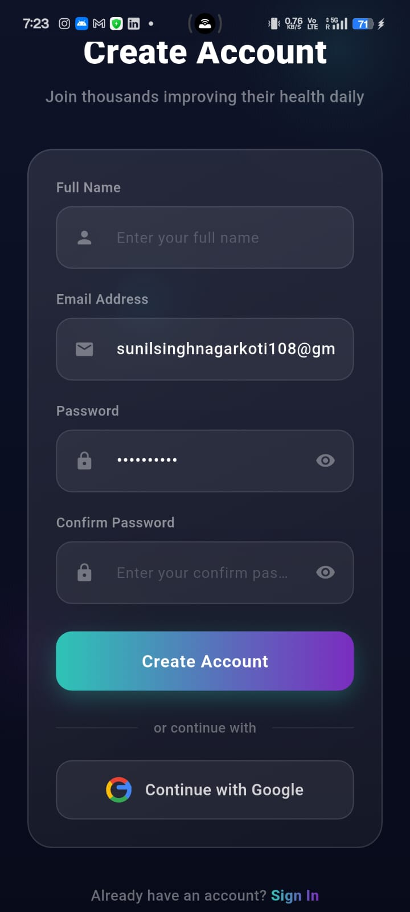
  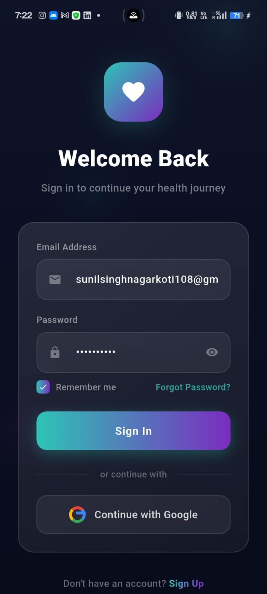
  
</div>

<details>
<summary>More Screenshots</summary>

<div align="center">
  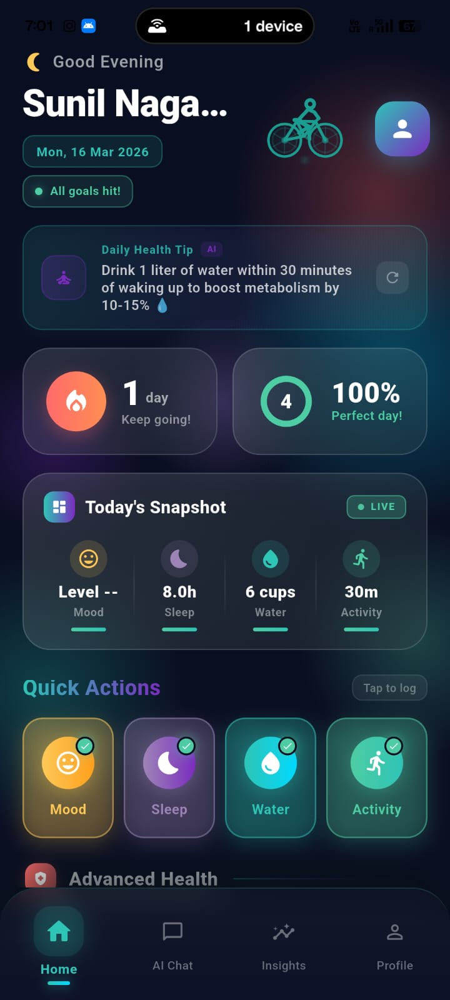
  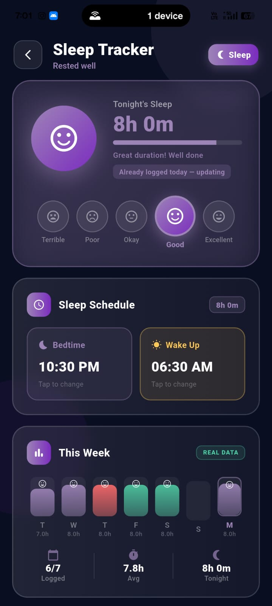
  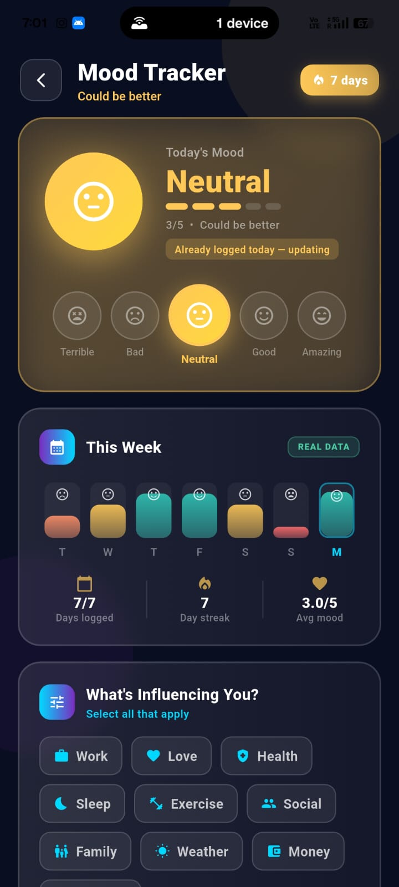
  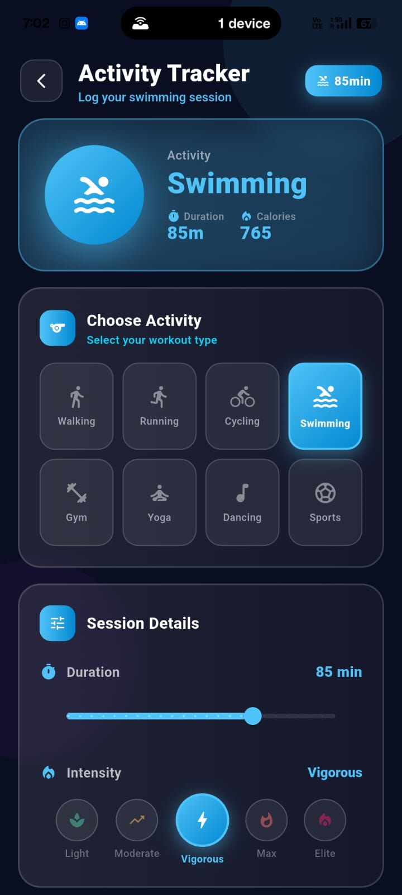
  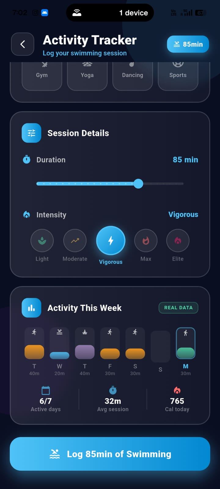
  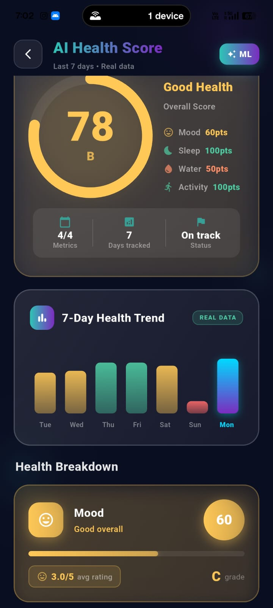
  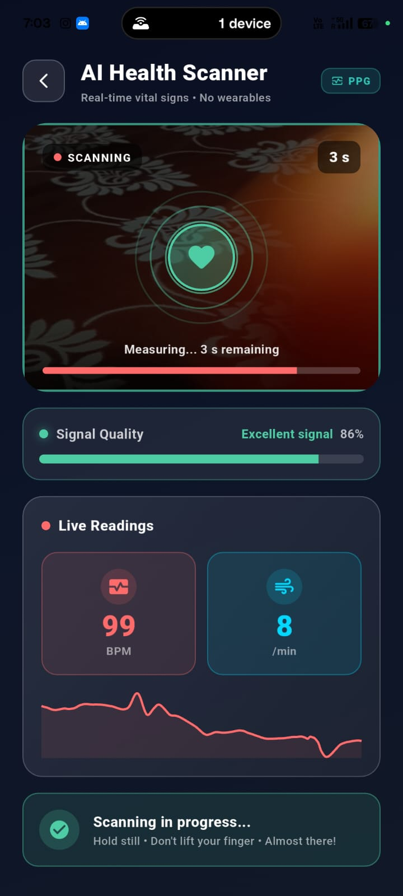
  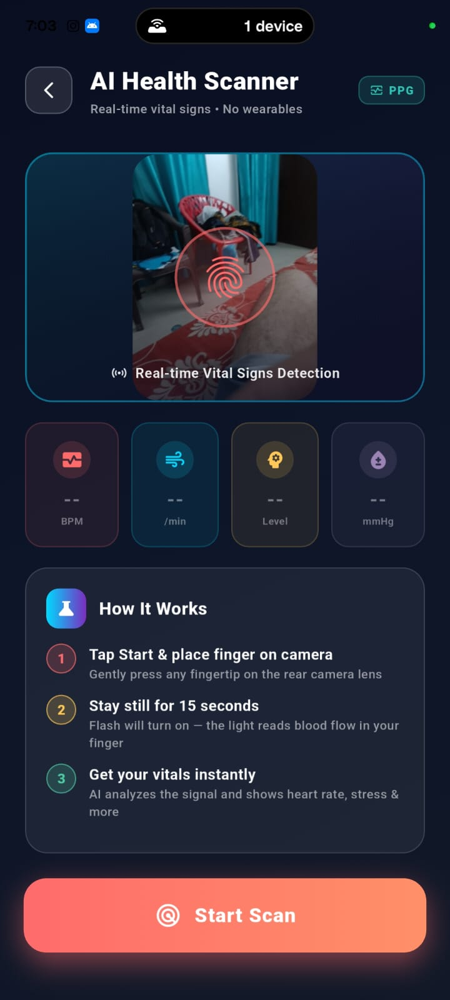
  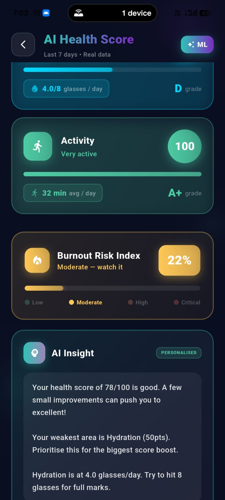
  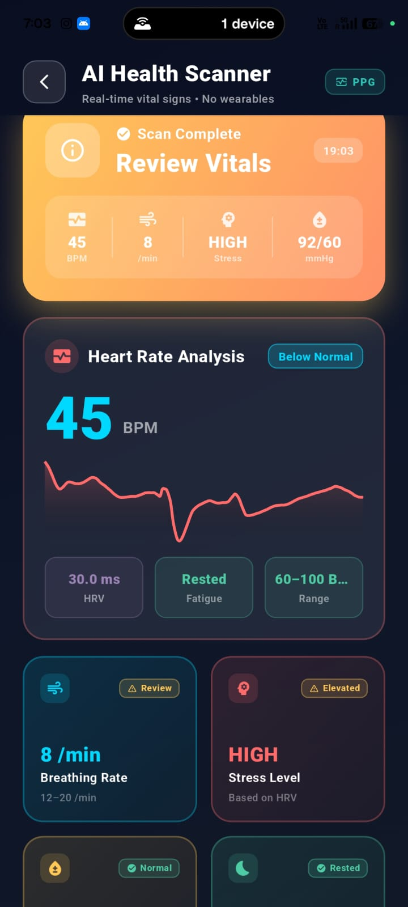
  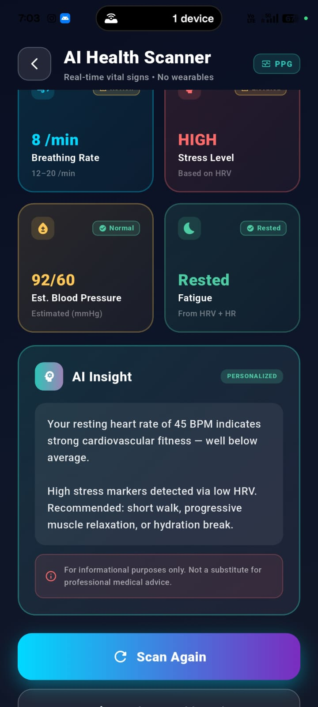
  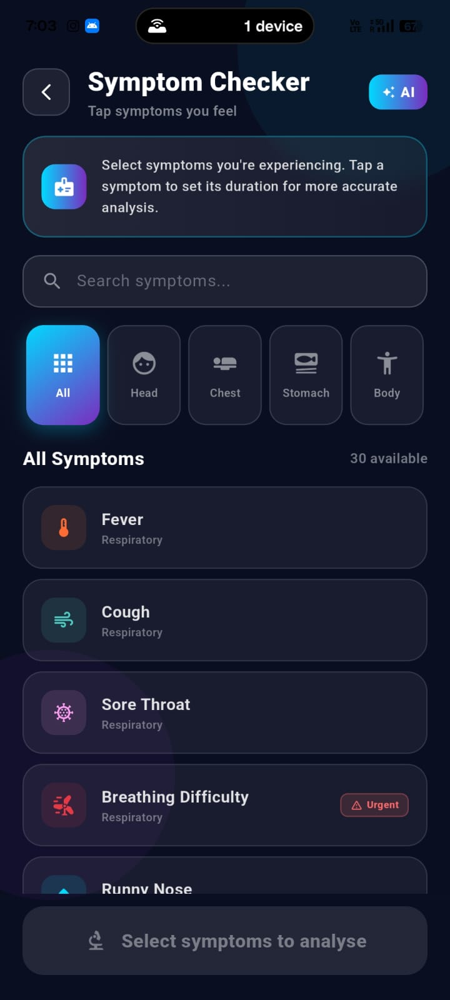
  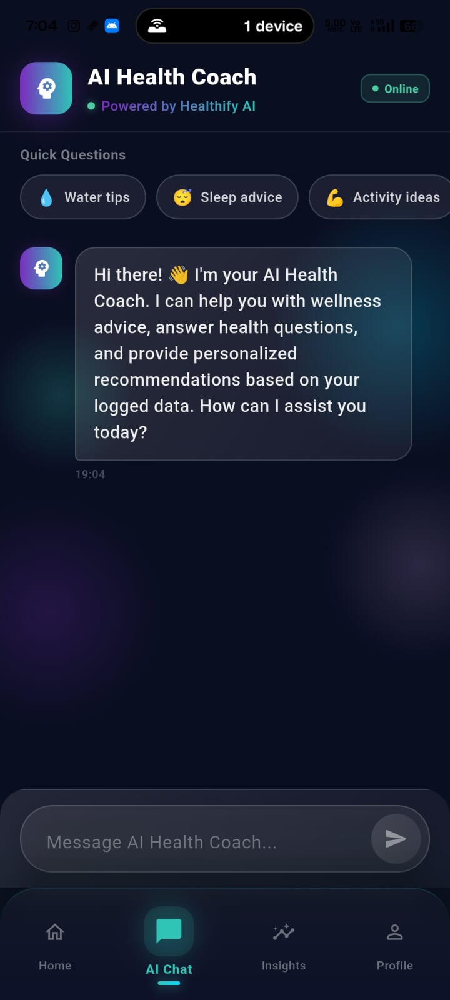
  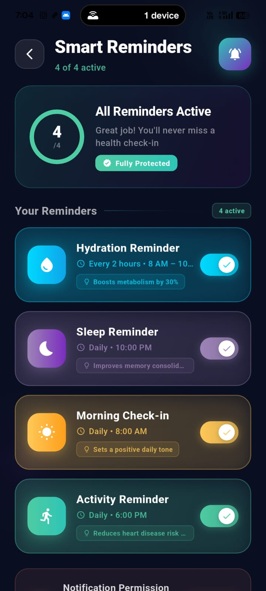
  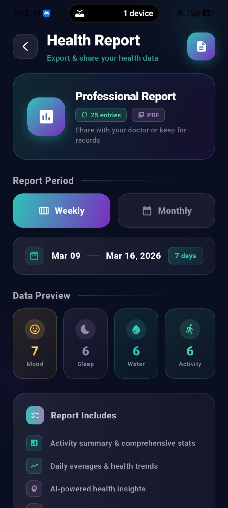
  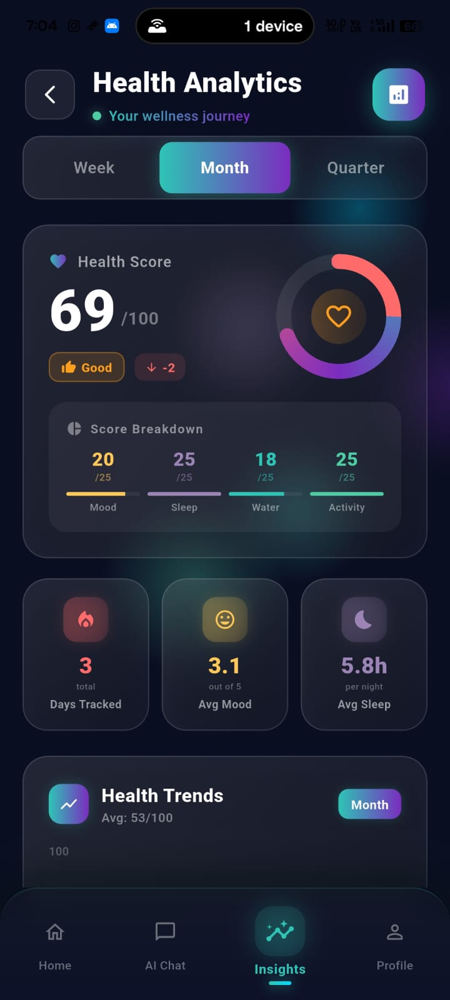
  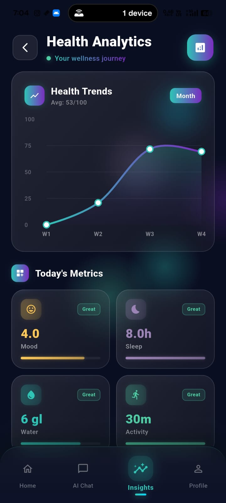
  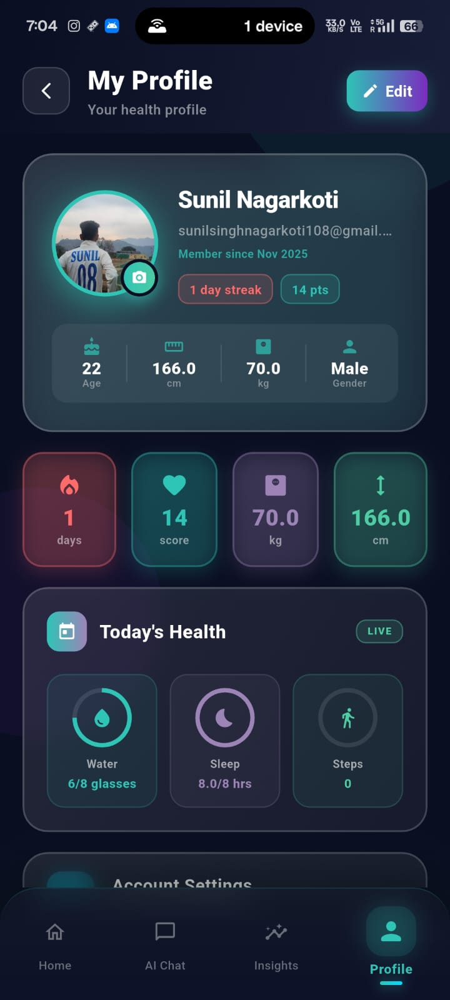
  
  
</div>

</details>

---

## 🛠️ Tech Stack

- **Flutter** (3.x)
- **Firebase** (Auth, Firestore)
- **Google Sign-In**
- **Gemini AI API**
- **Provider** (State Management)
- **Shared Preferences**
- **Camera, Image Picker**
- **Local Notifications**
- **Charts: fl_chart, syncfusion_flutter_charts**
- **PDF: pdf**

---

## 📦 Getting Started

1. **Clone the repo:**
	```bash
	git clone https://github.com/SUNILNAGRKOTI/Health_Monitoring_App.git
	cd Health_Monitoring_App
	```
2. **Install dependencies:**
	```bash
	flutter pub get
	```
3. **Add your Firebase config:**
	- Place your `google-services.json` (Android) and `GoogleService-Info.plist` (iOS) in the respective folders.
4. **Run the app:**
	```bash
	flutter run
	```

---

## 🙏 Credits

- Developed by Sunil Nagarkoti
- Special thanks to the Flutter & Firebase community

---

## 📫 Contact

For queries or feedback, reach out at: sunilsinghnagarkoti108@gmail.com
